# 나무 장터 사용자 가이드

캡처 기준: 2026-06-14 / 로컬 실행 환경 `http://localhost:5173`

이 문서는 실제 테스트 계정으로 로그인한 뒤 화면별 캡처와 함께 기본 사용 방법을 정리한 가이드입니다.

## 테스트 계정

| 역할 | 이메일 | 비밀번호 |
| --- | --- | --- |
| 관리자 | `admin@namu.com` | `admin` |
| 수요자 | `user1@test.com` | `user1` |
| 공급자 | `user6@test.com` | `user6` |

## 공통 화면

### 로그인

- 이메일과 비밀번호를 입력한 뒤 로그인합니다.
- 로그인한 계정의 역할에 따라 수요자, 공급자, 관리자 화면으로 이동합니다.
- 테스트 중 세션이 만료되면 이 화면에서 다시 로그인합니다.

### 회원가입

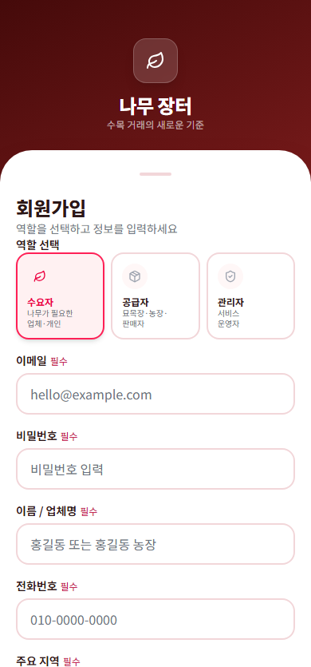

- 신규 사용자는 역할과 기본 정보를 입력해 가입합니다.
- 가입 후에는 로그인 화면에서 등록한 계정으로 접속합니다.

## 수요자 가이드

수요자 계정: `user1@test.com`

### 내 수요 목록

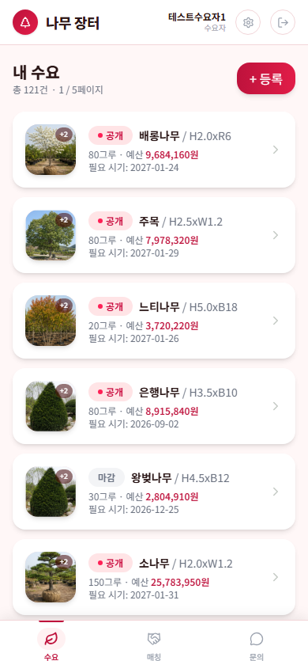

- 등록한 수요 목록을 확인합니다.
- 카드에는 수목명, 규격, 수량, 예상 금액, 필요 시기가 표시됩니다.
- `+ 등록` 버튼으로 새 수요를 작성합니다.
- 하단 탭에서 수요, 매칭, 문의 화면으로 이동합니다.

### 수요 등록

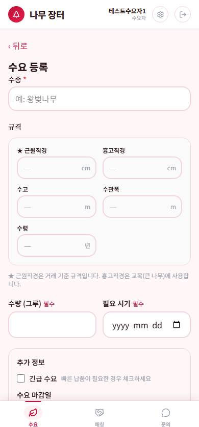

- 수목명, 규격, 필요 수량, 희망 단가, 수요 마감일 등을 입력합니다.
- 사진, 위치, 상세 요청 내용을 함께 입력하면 공급자가 내용을 판단하기 쉽습니다.
- 필수 항목을 채운 뒤 등록 버튼을 눌러 수요를 생성합니다.

### 수요 상세

- 등록한 수요의 상세 조건과 현재 상태를 확인합니다.
- 수정 버튼으로 내용을 보정할 수 있습니다.
- 매칭이나 문의가 연결된 경우 관련 화면에서 후속 진행 상태를 확인합니다.

### 수요 수정

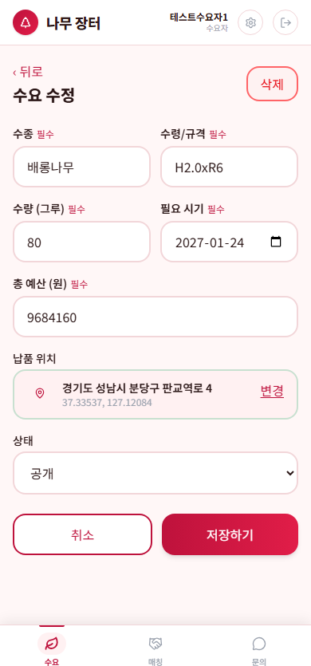

- 기존 수요의 수목명, 규격, 수량, 마감일, 위치, 사진 등을 변경합니다.
- 저장 후 목록이나 상세 화면에서 수정 결과를 확인합니다.

### 매칭 목록

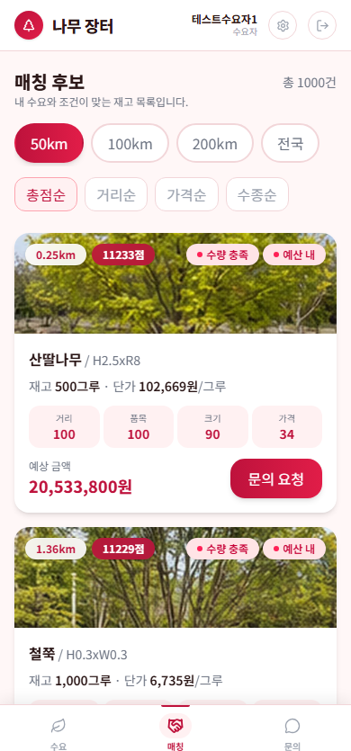

- 내 수요에 연결된 공급 후보와 매칭 상태를 확인합니다.
- 진행 중인 매칭을 선택하면 상세 견적과 공급 정보를 확인할 수 있습니다.

### 매칭 상세

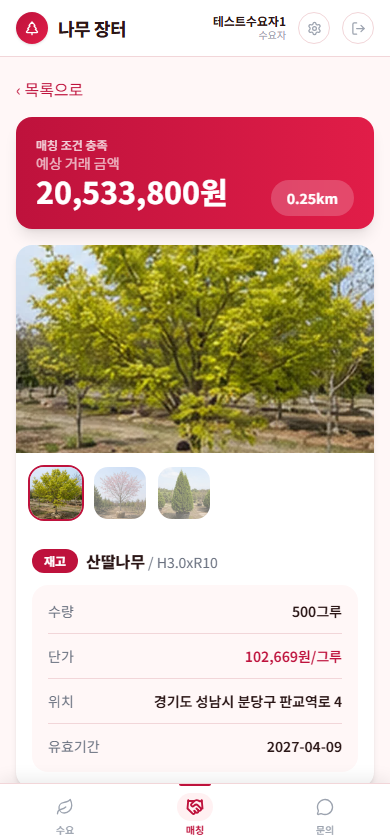

- 수요 조건과 공급자의 재고 조건을 비교합니다.
- 가격, 수량, 위치, 상태를 확인한 뒤 필요하면 문의 화면에서 대화를 이어갑니다.

### 문의 목록

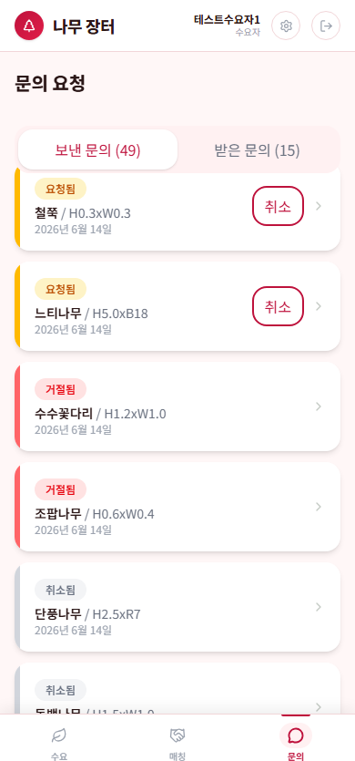

- 공급자 또는 관리자와 주고받은 문의를 확인합니다.
- 문의 상태와 최근 내용을 보고 확인이 필요한 항목을 선택합니다.

### 문의 상세

- 문의 제목, 내용, 답변 또는 진행 상태를 확인합니다.
- 추가 확인이 필요한 경우 화면의 입력 영역이나 연결된 기능을 통해 후속 내용을 남깁니다.

## 공급자 가이드

공급자 계정: `user6@test.com`

### 재고 목록

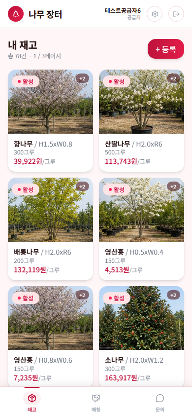

- 내가 등록한 수목 재고를 확인합니다.
- 카드에는 수목명, 규격, 보유 수량, 단가, 유효 기간이 표시됩니다.
- `+ 등록` 버튼으로 새 재고를 등록합니다.
- 하단 탭에서 재고, 매칭, 문의 화면으로 이동합니다.

### 재고 등록

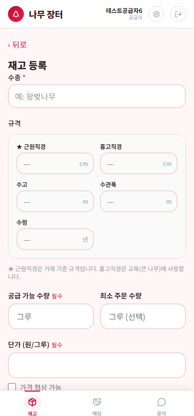

- 수종, 근원직경, 흉고직경, 수고, 수관폭, 수량, 단가를 입력합니다.
- 농장 주소, 야적장 주소, 수목 위치 메모, 지도 위치, 사진을 입력합니다.
- 필수 항목과 사진을 채운 뒤 등록 버튼으로 공급 가능 재고를 생성합니다.

### 재고 상세

- 등록된 재고의 규격, 가격, 위치, 사진, 상태를 확인합니다.
- 수요와 매칭될 수 있는 핵심 정보가 정확한지 점검합니다.

### 재고 수정

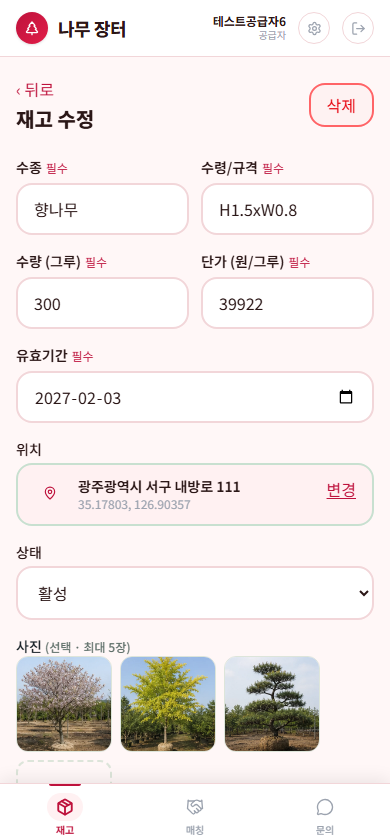

- 기존 재고의 수량, 단가, 규격, 위치, 유효 기간, 사진을 변경합니다.
- 수량이나 유효 기간이 실제 보유 상황과 다르면 이 화면에서 갱신합니다.

### 매칭 목록

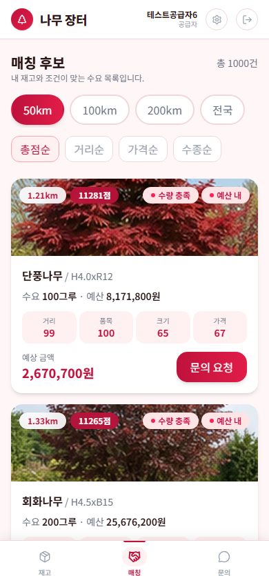

- 내 재고와 연결된 수요 매칭을 확인합니다.
- 매칭 상태를 보고 거래 가능성이 높은 항목을 우선 검토합니다.

### 매칭 상세

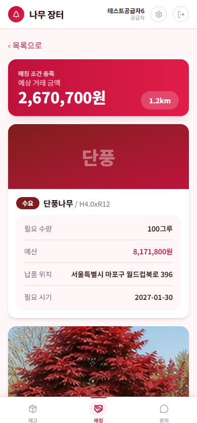

- 수요자의 요청 조건과 내 재고 정보를 비교합니다.
- 가격, 수량, 일정, 위치 조건을 확인하고 필요한 경우 문의로 후속 조율을 진행합니다.

### 문의 목록

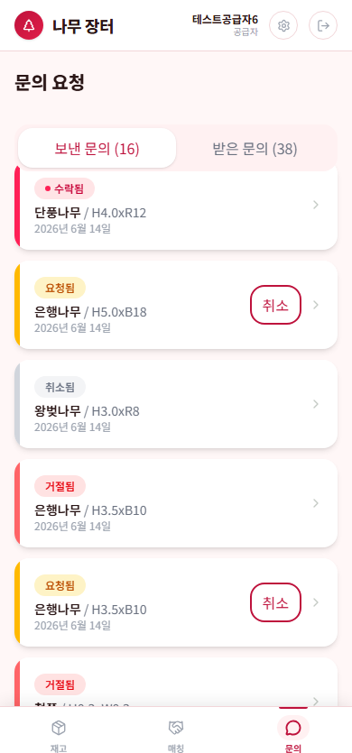

- 수요자 또는 관리자와 연결된 문의를 확인합니다.
- 답변이 필요한 문의를 선택해 상세 내용을 확인합니다.

### 문의 상세

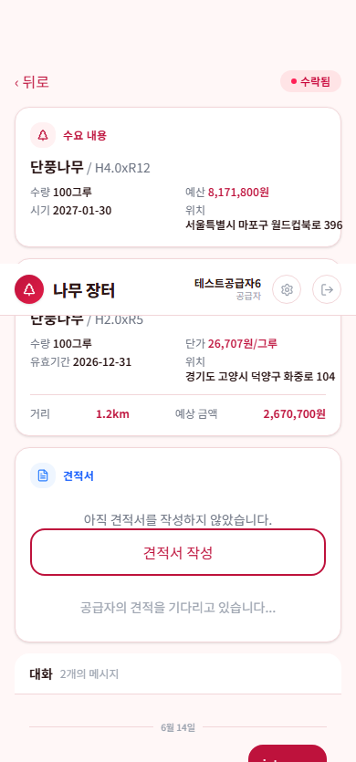

- 문의 내용, 연결된 수요 또는 재고 정보, 진행 상태를 확인합니다.
- 거래 조건 확인이나 추가 설명이 필요한 경우 답변 흐름에 맞춰 대응합니다.

## 관리자 가이드

관리자 계정: `admin@namu.com`

### 관리자 대시보드

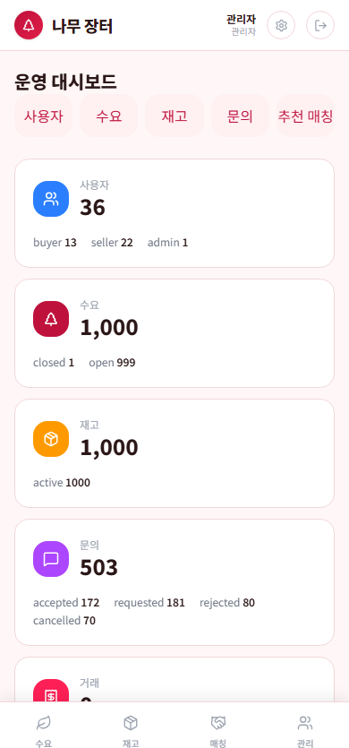

- 사용자, 수요, 재고, 매칭, 문의 현황을 한눈에 확인합니다.
- 상단 또는 카드의 관리 메뉴를 눌러 세부 관리 화면으로 이동합니다.

### 사용자 관리

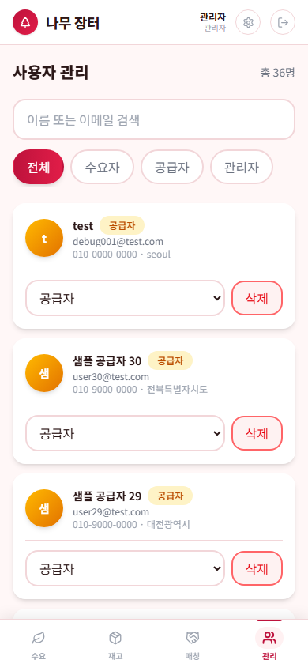

- 등록된 사용자 목록과 역할을 확인합니다.
- 수요자, 공급자, 관리자 계정이 정상적으로 생성되어 있는지 점검합니다.

### 수요 관리

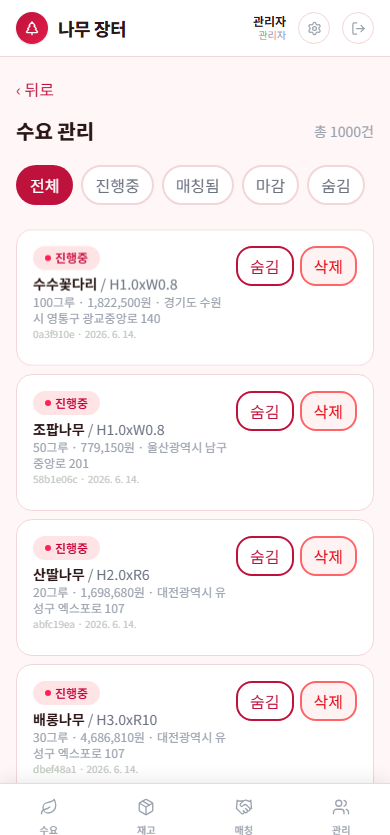

- 전체 수요 목록을 확인합니다.
- 수요 제목, 수목명, 규격, 수량, 마감일, 상태를 보고 이상 데이터나 누락 항목을 점검합니다.

### 재고 관리

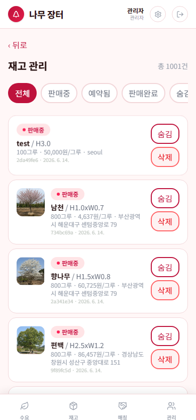

- 공급자가 등록한 전체 재고를 확인합니다.
- 규격, 가격, 수량, 위치, 유효 기간 등 거래에 필요한 정보가 충분한지 확인합니다.

### 매칭 관리

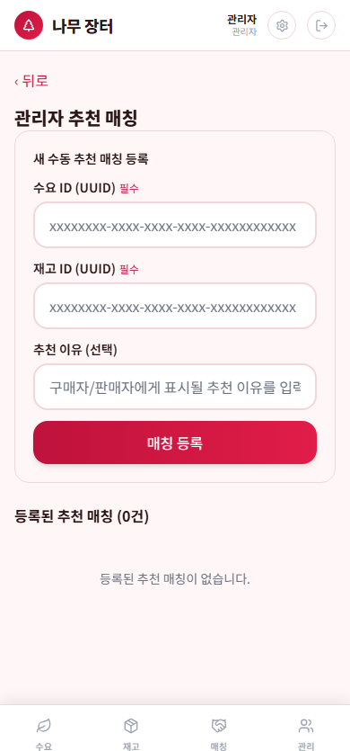

- 수요와 재고가 연결된 매칭 현황을 확인합니다.
- 상태별로 진행 중, 완료, 취소 항목을 추적합니다.

### 문의 관리

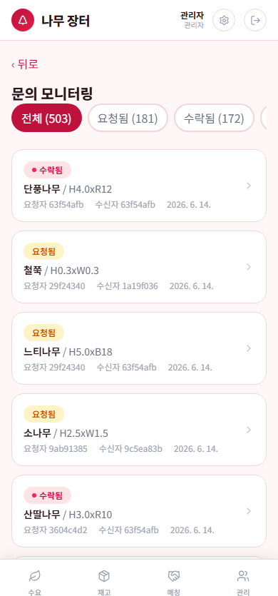

- 전체 문의 목록을 확인합니다.
- 처리 지연 또는 확인이 필요한 문의를 우선 검토합니다.

### 문의 상세 관리

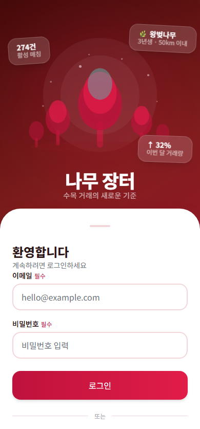

- 문의의 상세 내용과 관련 정보를 확인합니다.
- 운영자가 확인해야 할 내용이 있으면 상태를 기준으로 후속 조치를 진행합니다.

